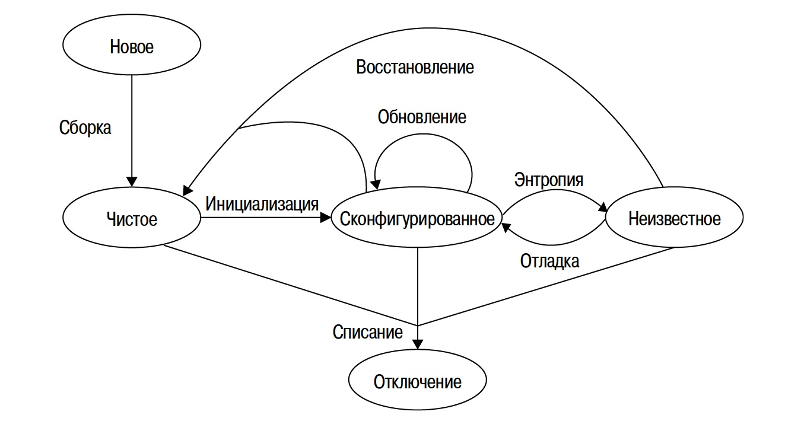

## Рабочие станции

Модель жизненного цикла машины и ее ОС, разработанная Эвардом

На схеме изображено пять состояний: новое, чистое, сконфигурированное, неизвестное и отключенное.
* **Новое** состояние относится к совершенно новой машине
* **Чистое** состояние относится к машине с установленной, но ещё не настроенной ОС.
* **Сконфигурированное** состояние означает, что система настроена и функционирует должным образом.
* **Неизвестное состояние** относится к компьютеру, который был неправильно сконфигурирован или конфигурация которого устарела.
* **Отключенное состояние** относится к машине, которая была списана и отключена.

**Энтропия** - процесс нежелательной амортизации, приводящий компьютер в неизвестное состояние, которое можно исправить с помощью отладки.

Для обеспечения целостности операционной системы нужно найти необходимый баланс между предоставлением пользователям полного доступа и ограничением их прав. Этот баланс влияет на скорость разрушения операционной системы.

Автоматизация обновления ПО схожа с автоматизацией первичной установки, но между ними есть и несколько существенных различий.
* Узел сети находится в рабочем состоянии.
* Узел сети находится в офисе.
* Отсутствует необходимость в физическом доступе.
* Узел сети уже используется.
* Узел сети может не находиться в "известном состоянии".
* Узел сети может использоваться сотрудниками в процессе обновления.
* Узел сети может отсутствовать.
* Узел сети может иметь мультисистемную загрузку.

Ошибки обновления, которые перевели машину в нерабочее состояние, гораздо заметнее и вызывают гораздо большее раздражение у пользователей.
Применив метод "одна, несколько, много" можно снизить риск ошибок обновления.
* Прежде всего нужно установить обновление на одну машину.
* Потом попробовать произвести те же действия на нескольких других машинах.
* В конце, протестировав систему и убедившись в безопасности обновления, переходить к большим и большим группам устройств.

Настройка DHCP-сервера может сэкономить много времени, особенно если потребуется изменить нумерацию IP адресов или маску подсети.

В идеале пользователи должны принимать участие в процессе разработки с самого начала. Например формировать список приложений, которые нужно включить в конфигурацию.

**Выводы**:
1. Первичная установка ОС должна быть автоматизирована.
1. Обновление программного обеспечения должно быть автоматизировано.
1. Конфигурация сети должна администрироваться централизовано с помощью такой системы, как DHCP.

## Серверы

При покупке сервера нужно продумать, как будет происходить его ремонт. Заключить контракт на обслуживание или справляться собственными силами.

При выборе контракта на обслуживание могут помочь следующие сценарии:

1. Не критически важный сервер:
    * Допустим контракт на обслуживание со сроком обработки заявки в течение 1-2 дней.
1. Большая группа идентичных серверов:
    * Ремонт силами сотрудников или доступный контракт на замену компонентов.
1. Постепенная модернизация:
    * Стандартизируйте срок обеспечения запасными компонентами для моделей или групп с одинаковым комплектом. Обновляйте модели после исчерпания запасов.
1. Важные узлы:
    * Храните запасы для часто выходящих из строя компонентов, заключите контракт на обслуживание для остальных. В случае множества моделей от одного поставщика, рассмотрите контракт с техником для работы внутри компании.
1. Критически важный узел:
    * Рассмотрите контракт на обслуживание с техником и дублирующей машиной для замены сбойных устройств, особенно для компаний, не специализирующихся в высоких технологиях.

В результате, нужно искать компромисс между хранением запасных частей и сервисным контрактом.

Серверы необязательно должны работать под управлением тех же ОС, что и их клиенты.

Для серверов необходима возможность удаленного обслуживания.

При приобретении серверного оборудования нужно обратить особое внимание на то, какой тип удаленного доступа к консоли будет доступен.

Часто создают отдельную сеть для резервного копирования и мониторинга. Так как эти задачи серьезно нагружают сеть и могут мешать пользователям.

**Выводы**:
1. Серверы, как и любое другое оборудование, иногда дают сбои, поэтому необходимо заключить контракт на обслуживание или составить план восстановления, а также предусмотреть возможность резервного копирования и восстановления данных.
1. Пространство в машинном зале необходимо распределить до момента покупки, а не когда прибудет сервер. Заранее стоит спланировать электросеть, пропускную способность сети и систему охлаждения.
1. Серверам необходима возможность удаленного администрирования. Аппаратные или программные системы позволяют удаленно выполнять консольный доступ.
1. Наличие зеркалированного системного диска, резервных источников питания и других дополнительных компонентов повышает период работоспособного состояния системы.
